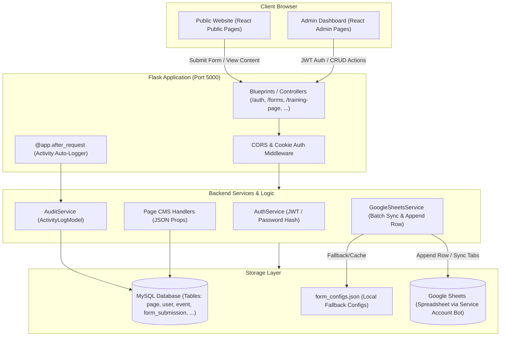
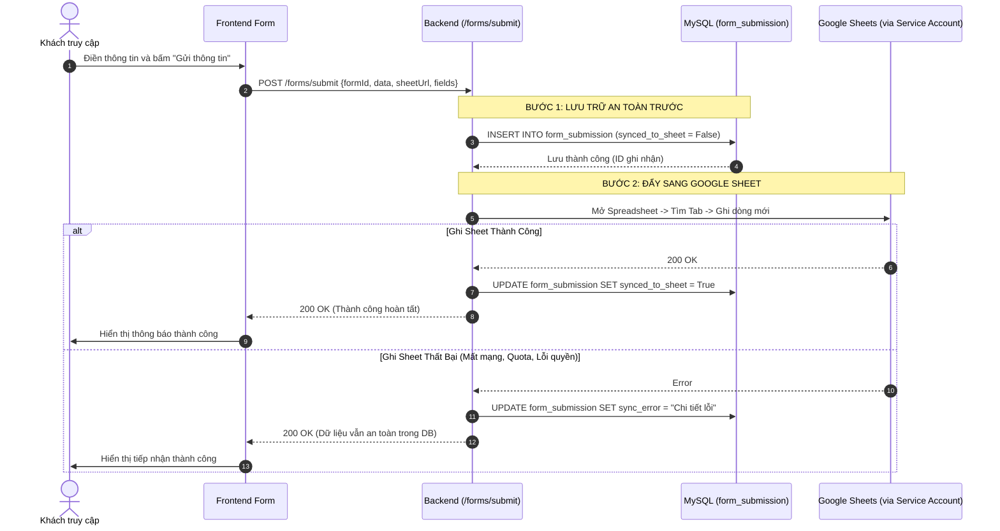

# Trung Tâm Công Nghiệp Sáng Tạo (Creative Industry Center)
### Hệ Thống Quản Trị & Cổng Thông Tin Toàn Diện (System Architecture & Developer/AI Context Manual)

---

> **TÀI LIỆU DÀNH CHO LẬP TRÌNH VIÊN & AI AGENTS**  
> File tài liệu này đóng vai trò là **Ngữ cảnh Hệ thống Duy nhất (Single Source of Truth - SSOT)**, ghi nhận toàn bộ luồng hoạt động từ Backend đến Frontend, cấu trúc dữ liệu, các quy trình nghiệp vụ và nguyên tắc bất biến của hệ thống. Mỗi khi phát triển tính năng mới hoặc sửa lỗi bằng AI, hãy tham chiếu tài liệu này để tránh xung đột kiến trúc.

---

## MỤC LỤC
1. [Tổng Quan Dự Án & Sứ Mệnh](#1-tổng-quan-dự-án--sứ-mệnh)
2. [Ngăn Xếp Công Nghệ (Technology Stack)](#2-ngăn-xếp-công-nghệ-technology-stack)
3. [Sơ Đồ Kiến Trúc Tổng Thể & Luồng Dữ Liệu](#3-sơ-đồ-kiến-trúc-tổng-thể--luồng-dữ-liệu)
4. [Cấu Trúc Thư Mục Dự Án](#4-cấu-trúc-thư-mục-dự-án)
5. [Thiết Kế Cơ Sở Dữ Liệu & Cơ Chế Page-CMS](#5-thiết-kế-cơ-sở-dữ-liệu--cơ-chế-page-cms)
6. [Chi Tiết Nghiệp Vụ Từng Module (Module Breakdown & Flows)](#6-chi-tiết-nghiệp-vụ-từng-module)
   - [6.1. Xác thực & Phân quyền (Auth & RBAC)](#61-xác-thực--phân-quyền-auth--rbac)
   - [6.2. Nhật ký Hoạt động (Activity Log / Audit Trail)](#62-nhật-ký-hoạt-động-activity-log--audit-trail)
   - [6.3. Trang Chủ (Home / Landing Page)](#63-trang-chủ-home--landing-page)
   - [6.4. Sự Kiện & Hoạt Động (Events & Newsletter)](#64-sự-kiện--hoạt-động-events--newsletter)
   - [6.5. Diễn Đàn Kinh Tế Kỷ Lục (Forum)](#65-diễn-đàn-kinh-tế-kỷ-lục-forum)
   - [6.6. Hợp Tác & Đào Tạo (Training & Education)](#66-hợp-tác--đào-tạo-training--education)
   - [6.7. Dự Án Tiêu Biểu (Projects)](#67-dự-án-tiêu-biểu-projects)
   - [6.8. Bảng Vàng & Kỷ Lục Gia (Records & Honor Roll)](#68-bảng-vàng--kỷ-lục-gia-records--honor-roll)
   - [6.9. Chuyện Nhà Sáng Nghiệp (Founder Stories)](#69-chuyện-nhà-sáng-nghiệp-founder-stories)
   - [6.10. Liên Hệ & Đề Xuất (Contact & Feedback)](#610-liên-hệ--đề-xuất-contact--feedback)
   - [6.11. Quản Lý Biểu Mẫu & Động Cơ Đồng Bộ Google Sheets (Forms & Sheets Engine)](#611-quản-lý-biểu-mẫu--động-cơ-đồng-bộ-google-sheets)
   - [6.12. Điều Hướng, Logo, Chân Trang & Cài Đặt Hệ Thống](#612-điều-hướng-logo-chân-trang--cài-đặt-hệ-thống)
7. [Hệ Thống Thiết Kế Giao Diện Quản Trị (Admin Design System)](#7-hệ-thống-thiết-kế-giao-diện-quản-trị-admin-design-system)
8. [Cơ Chế Lưu Dữ Liệu Form 2 Lớp (Double-Layer Submission Flow)](#8-cơ-chế-lưu-dữ-liệu-form-2-lớp-double-layer-submission-flow)
9. [Hướng Dẫn Khởi Chạy & Cài Đặt Môi Trường](#9-hướng-dẫn-khởi-chạy--cài-đặt-môi-trường)
10. [Danh Sách Tài Khoản Thử Nghiệm (Demo Accounts)](#10-danh-sách-tài-khoản-thử-nghiệm-demo-accounts)
11. [Nguyên Tắc Bất Biến Khi Sửa Code (Developer & AI Invariants)](#11-nguyên-tắc-bất-biến-khi-sửa-code-developer--ai-invariants)

---

## 1. TỔNG QUAN DỰ ÁN & SỨ MỆNH

**Creative Industry Center** là cổng thông tin điện tử và hệ thống quản trị nội dung chuyên sâu được thiết kế phục vụ mạng lưới các nhà sáng nghiệp, chuyên gia, các kỷ lục gia Việt Nam (Viện Kỷ lục Việt Nam - VietKings) và cộng đồng đổi mới sáng tạo.

### Các mục tiêu cốt lõi:
1. **Quảng bá & Truyền thông**: Giới thiệu các dự án sáng tạo, diễn đàn kinh tế kỷ lục, hoạt động đào tạo phát triển tài sản trí tuệ và câu chuyện khởi nghiệp.
2. **CMS Động Linh Hoạt**: Ban quản trị có thể thay đổi toàn bộ nội dung banner, tiêu đề, danh sách diễn giả, số liệu thống kê, và layout các khối trực tiếp trên Dashboard mà không cần can thiệp mã nguồn.
3. **Form Builder & Google Sheets Sync**: Mọi biểu mẫu (đăng ký tham gia sự kiện, ghi danh đào tạo, đề xuất dự án, đề cử kỷ lục, liên hệ) có thể tùy biến động và **tự động ghi trực tiếp vào từng tab tương ứng của Google Sheets** qua Google Service Account.

---

## 2. NGĂN XẾP CÔNG NGHỆ (TECHNOLOGY STACK)

### Backend
* **Ngôn ngữ & Framework**: Python 3.10+, Flask
* **ORM & Database**: SQLAlchemy, PyMySQL / MySQL
* **Bảo mật & Xác thực**: PyJWT (JSON Web Token trong Cookie HttpOnly), Werkzeug (`generate_password_hash` pbkdf2:sha256)
* **Tích hợp Google API**: `google-auth`, `google-api-python-client`, `gspread` (Service Account Robot)
* **Tài liệu API**: Flasgger (OpenAPI / Swagger UI)
* **Kiến trúc mã nguồn**: Phân lớp chuẩn **Controller -> Service -> Repository -> Model -> DTO**

### Frontend
* **Core**: React 19, Vite 6
* **Router**: React Router DOM v7
* **Styling**: Tailwind CSS v4, Vanilla CSS Custom Variables (`--admin-*` tokens)
* **Icons**: Lucide React, FontAwesome
* **HTTP Client**: Axios (với interceptors tự động đính kèm JWT và timeout xử lý riêng biệt)
* **State Management**: React Context (`AuthContext`, `SiteSettingsContext`)

---

## 3. SƠ ĐỒ KIẾN TRÚC TỔNG THỂ & LUỒNG DỮ LIỆU



---

## 4. CẤU TRÚC THƯ MỤC DỰ ÁN

```
creative-industry-center/
├── README.md                      # Tài liệu ngữ cảnh hệ thống (file này)
├── ADMIN_ACCOUNTS.txt             # Thông tin tài khoản quản trị thử nghiệm
├── docker-compose.yml             # Cấu hình khởi chạy Docker (DB, Backend, Frontend)
│
├── backend/                       # BACKEND SOURCE CODE (FLASK)
│   ├── app.py                     # Entrypoint Flask app, đăng ký Blueprints & Migrations
│   ├── config.py                  # Cấu hình môi trường (DB URL, Port, Secret Key)
│   ├── extensions.py              # Khởi tạo instance db (SQLAlchemy)
│   ├── form_configs.json          # File lưu trữ cấu hình 8 biểu mẫu & trạng thái lastSyncedAt
│   ├── service_account.json       # Khóa Google Service Account Bot để ghi vào Google Sheet
│   ├── controllers/               # Lớp tiếp nhận Request và trả về JSON Response
│   │   ├── AuthController.py      # Đăng nhập, đăng xuất, lấy thông tin me
│   │   ├── FormController.py      # Submit form, Sync fields, Sync-All worksheets, Service Account
│   │   ├── ActivityLogController.py# Quản trị lịch sử thao tác hệ thống
│   │   ├── UserController.py      # Quản lý tài khoản Admin/Manager/Editor
│   │   ├── EventController.py     # CRUD sự kiện và danh mục sự kiện
│   │   ├── ProjectPageController.py# Quản trị cấu hình trang Dự án (Header, Proposal, Selector)
│   │   ├── TrainingPageController.py# Quản trị cấu hình trang Đào tạo (Header, Models, Proposal)
│   │   ├── ForumPageController.py # Quản trị Diễn đàn Kỷ lục (Hero, Speakers, Agenda, Form)
│   │   ├── SiteSettingsController.py# Quản trị Brand Name, Logo, Hotline, Footer
│   │   └── pages/                 # Controllers dành riêng cho các Page có schema phức tạp
│   │       ├── record_controller.py   # Quản lý trang Kỷ lục & Bảng vàng vinh danh
│   │       ├── founder_controller.py  # Quản lý trang Chuyện Nhà Sáng Nghiệp
│   │       └── award_controller.py    # Quản lý danh hiệu và giải thưởng
│   ├── models/                    # Lớp định nghĩa bảng Cơ sở dữ liệu (SQLAlchemy)
│   │   ├── PageModel.py           # Bảng `page` (Lưu dynamic JSON props cho từng trang)
│   │   ├── FormSubmissionModel.py # Bảng `form_submission` (Lưu dự phòng dữ liệu người dùng nộp)
│   │   ├── UserModel.py           # Bảng `user` (Tài khoản, mật khẩu băm, role)
│   │   ├── ActivityLogModel.py    # Bảng `activity_log` (Lịch sử thao tác của các user)
│   │   ├── EventModel.py          # Bảng `event` & `event_category`
│   │   ├── ProjectModel.py        # Bảng `project` & `project_category`
│   │   ├── TrainingModel.py       # Bảng `training`
│   │   ├── RecordModel.py         # Bảng `record`
│   │   └── AwardModel.py          # Bảng `award`
│   ├── services/                  # Lớp xử lý logic nghiệp vụ
│   │   ├── google_sheets_service.py # Core service tương tác Google Sheets API (gspread)
│   │   └── audit_service.py       # Tự động trích xuất request ghi vào ActivityLog
│   └── seed.py                    # Script khởi tạo toàn bộ dữ liệu mẫu ban đầu
│
└── frontend/                      # FRONTEND SOURCE CODE (REACT + VITE)
    ├── package.json               # Dependencies & build scripts
    ├── vite.config.js             # Cấu hình Vite bundler & proxy
    ├── src/
    │   ├── main.jsx               # Render React root DOM
    │   ├── App.jsx                # Thiết lập BrowserRouter, Context Providers & Router View
    │   ├── routes/index.jsx       # Định nghĩa toàn bộ Public Routes & Admin Nested Routes
    │   ├── config/                # Cấu hình base API URL, menu navigation items
    │   ├── context/               # AuthContext (trạng thái đăng nhập), SiteSettingsContext
    │   ├── api/                   # Lớp gọi HTTP Axios theo từng domain nghiệp vụ
    │   │   ├── authApi.js, formApi.js, projectPageApi.js, trainingPageApi.js, ...
    │   ├── services/
    │   │   └── googleSheetService.js # Quản lý 8 mẫu form mặc định & hàm gọi đồng bộ Google Sheets
    │   ├── layout/                # Layout khung
    │   │   ├── Header.jsx, Footer.jsx (Public Layout)
    │   │   └── Admin/AdminLayout.jsx  (Admin Sidebar, Topbar, Content View)
    │   ├── components/            # Bộ components chia theo tính năng
    │   │   ├── Admin/             # Toàn bộ components của trang quản trị
    │   │   │   ├── Base/          # FormBuilder.jsx, ImageUploader.jsx...
    │   │   │   ├── Common/        # AdminButton, AdminPageHeader, AdminTabs, AdminToast, AdminModal...
    │   │   │   ├── Forms/         # SheetLinkConfig, FormListSidebar, FormPreviewContainer...
    │   │   │   ├── Forum/         # ForumRegistrationEditor, ForumHeroEditor...
    │   │   │   ├── Projects/      # ProjectProposalEditor, ProjectSelector...
    │   │   │   ├── Training/      # TrainingProposalEditor, TrainingModelsEditor...
    │   │   │   └── RecordHolder/  # RecordHonorRoll, RecordAdminManager...
    │   │   └── shared/            # DynamicFormRenderer.jsx (render form ngoài giao diện từ schema)
    │   └── pages/                 # Các trang giao diện
    │       ├── Admin/             # AdminDashboard, AdminFormsPage, AdminEvents, AdminProjects...
    │       └── [Public Pages]     # Home, About, Events, Projects, Forum, Training, Records...
```

---

## 5. THIẾT KẾ CƠ SỞ DỮ LIỆU & CƠ CHẾ PAGE-CMS

Hệ thống kết hợp 2 giải pháp lưu trữ:
1. **Bảng Thực Thể Chuẩn Hóa (Entity Tables)**: Dành cho các đối tượng có quan hệ bảng, phân trang hoặc bộ lọc: `user`, `event`, `project`, `training`, `record`, `award`, `activity_log`, `form_submission`.
2. **Bảng Dynamic Page-CMS (`page`)**: Dành cho các trang giao diện có cấu trúc linh hoạt theo từng khối section.

### Schema Bảng `page` (PageModel.py):
| Cột | Kiểu | Mô tả |
| :--- | :--- | :--- |
| `id` | `INT (PK)` | ID duy nhất của trang (VD: 1: Home, 4: Projects, 9: Training, 10: Forum...) |
| `name` | `VARCHAR(255)` | Tên trang quản trị (VD: "Trang Hợp tác & Đào tạo") |
| `slug` | `VARCHAR(255)` | Đường dẫn ngoài website (VD: `/trainings`, `/forum`, `/projects`) |
| `props` | `JSON` | **Toàn bộ nội dung động**: Banner, Tiêu đề, Danh sách thẻ, Cấu hình form... |
| `is_visible` | `BOOLEAN` | Bật/Tắt hiển thị trên Menu Điều hướng ngoài website |
| `order_index`| `INT` | Thứ tự sắp xếp thứ bậc trên Header Menu |

> **Tại sao kiến trúc này tối ưu?**  
> Khi người quản trị thay đổi bất kỳ trường nào trên Dashboard (ví dụ thêm 1 diễn giả trong Diễn đàn, đổi tiêu đề Form đề xuất, sửa danh sách quyền lợi), frontend gửi PUT lên controller tương ứng để cập nhật đúng nhánh trong `props` JSON. Cơ sở dữ liệu không bao giờ phải chạy lệnh `ALTER TABLE` khi giao diện thay đổi bố cục.

---

## 6. CHI TIẾT NGHIỆP VỤ TỪNG MODULE

### 6.1. Xác thực & Phân quyền (Auth & RBAC)
* **Backend**: `controllers/AuthController.py`, `models/UserModel.py`.
* **Cơ chế**:
  * Đăng nhập gửi `username`/`password`. Backend kiểm tra bằng `check_password_hash`.
  * Khi thành công, sinh JWT token và lưu vào **HttpOnly Cookie** (`admin_token`) kèm trả về thông tin user trong response body.
  * Decorator `@require_role(["admin", "manager"])` kiểm tra quyền hạn trước mỗi endpoint nhạy cảm.
* **Roles**:
  * `admin`: Toàn quyền cao nhất. Duy nhất admin được tạo tài khoản mới và cấp quyền truy cập.
  * `manager`: Quản lý nội dung mọi trang, duyệt bài, quản trị biểu mẫu, xem user. Không được thêm user mới.
* **Frontend**: `context/AuthContext.jsx`, `components/Admin/ProtectedRoute.jsx`. Tự động redirect về `/admin/login` nếu chưa đăng nhập hoặc phiên hết hạn.

---

### 6.2. Nhật ký Hoạt động (Activity Log / Audit Trail)
* **Backend**: `models/ActivityLogModel.py`, `controllers/ActivityLogController.py`, `services/audit_service.py`.
* **Cơ chế**: Tự động hook qua `@app.after_request` trong `app.py`. Mọi thao tác ghi (`POST`, `PUT`, `DELETE`, `PATCH`) của người dùng đều tự động lưu vết:
  * Phương thức HTTP, Endpoint gọi đến.
  * Tên người dùng (`user_id` / `username`), Mã HTTP phản hồi (`200`, `201`, `400`...).
  * Địa chỉ IP client, Trình duyệt / User-Agent, Thời gian thực hiện.
* **Frontend**: `pages/Admin/AdminActivities.jsx` hiển thị bảng nhật ký trực quan, cho phép lọc theo loại thao tác và tìm kiếm người thực hiện.

---

### 6.3. Trang Chủ (Home / Landing Page)
* **Dữ liệu**: `Page` ID = 1.
* **Cấu trúc JSON `props`**:
  * `hero_section`: Tiêu đề lớn, slogan, hình nền, nút kêu gọi hành động (CTA).
  * `about_section`: Tóm tắt sứ mệnh Trung tâm, ảnh đại diện, số liệu thống kê.
  * `support_banner`: Biểu ngữ thông điệp hỗ trợ đồng hành.
* **Quản trị**: `pages/Admin/AdminHome.jsx` -> `controllers/HomeController.py`.

---

### 6.4. Sự Kiện & Hoạt Động (Events & Newsletter)
* **Dữ liệu**:
  * Bảng `event`: Quản lý danh sách sự kiện (tiêu đề, thời gian, địa điểm, diễn giả, trạng thái, ảnh).
  * Section `newsletter_section` trong `Page`: Nội dung giới thiệu đăng ký nhận tin.
* **Biểu mẫu tích hợp**:
  1. `event_newsletter`: Biểu mẫu đăng ký nhận bản tin ở cuối trang sự kiện.
  2. `event_registration`: Biểu mẫu đăng ký tham dự trực tiếp/trực tuyến của đại biểu (dạng Modal).
* **Đồng bộ**: Khi quản trị viên lưu nội dung newsletter tại `AdminEvents.jsx`, hệ thống tự động đồng bộ cấu hình form sang `event_newsletter` trong Google Sheets Service.

---

### 6.5. Diễn Đàn Kinh Tế Kỷ Lục (Forum)
* **Dữ liệu**: `Page` ID = 10 (`controllers/ForumPageController.py`).
* **Cấu trúc JSON `props`**:
  * `hero`: Tiêu đề, thời gian, địa điểm diễn đàn.
  * `pillars`: 4 trụ cột chiến lược của diễn đàn.
  * `speakers`: Danh sách diễn giả, chức danh, ảnh đại diện.
  * `agenda`: Lịch trình các phiên làm việc (Phiên sáng, Chiều, Gala).
  * `partners`: Danh sách đơn vị đồng hành và tài trợ.
  * `registration`: Cấu hình form đăng ký tham dự (`badge_text`, `form_title`, `form_fields`).
* **Biểu mẫu tích hợp**: `forum_registration`.
* **Quản trị**: `pages/Admin/AdminForum.jsx` tích hợp bộ soạn thảo linh hoạt, khi bấm Lưu sẽ tự động cập nhật form `forum_registration` sang trang Quản lý biểu mẫu và Google Sheets.

---

### 6.6. Hợp Tác & Đào Tạo (Training & Education)
* **Dữ liệu**:
  * Bảng `training`: Danh sách khóa đào tạo cụ thể (thời lượng, học phí, giảng viên).
  * `Page` ID = 9 (`controllers/TrainingPageController.py`): Header, Mô hình đào tạo (`models_section`), Cam kết chứng nhận (`certification_section`), Form đăng ký (`proposal_section`), Khóa học chọn lọc hiển thị (`selected_training_ids`).
* **Biểu mẫu tích hợp**: `training_registration`.
* **Quản trị**: `pages/Admin/AdminTraining.jsx` gồm 5 tabs. Tab **"Form Đăng ký / Đề xuất"** sử dụng `TrainingProposalEditor`, tự động đồng bộ sang Google Sheets khi lưu.

---

### 6.7. Dự Án Tiêu Biểu (Projects)
* **Dữ liệu**:
  * Bảng `project` & `project_category`: Danh mục dự án, hồ sơ từng dự án sáng tạo.
  * `Page` ID = 4 (`controllers/ProjectPageController.py`): `header_section`, `selected_project_ids` (chọn lọc dự án tiêu biểu), `proposal_section` (Cổng tiếp nhận đề xuất dự án mới).
* **Biểu mẫu tích hợp**: `project_proposal`.
* **Quản trị**: `pages/Admin/AdminProjects.jsx`. Tab **"Đề xuất dự án"** (`ProjectProposalEditor`) cho phép tùy biến tiêu đề, quyền lợi và các ô nhập liệu, tự động đồng bộ sang form `project_proposal`.

---

### 6.8. Bảng Vàng & Kỷ Lục Gia (Records & Honor Roll)
* **Dữ liệu**: Bảng `record` và `award` (`controllers/pages/record_controller.py`).
* **Tính năng nổi bật**:
  * Bảng vàng vinh danh (Honor Roll): Layout danh giá tôn vinh các kỷ lục gia và công trình tiêu biểu.
  * Tùy chọn Ẩn/Hiện từng bản ghi kỷ lục trên giao diện công cộng.
  * Modal xác nhận thay thế cho các hộp thoại `alert`/`confirm` nguyên thủy.
* **Biểu mẫu tích hợp**: `record_nomination` (Cổng nộp hồ sơ đề cử danh hiệu Kỷ lục mới).

---

### 6.9. Chuyện Nhà Sáng Nghiệp (Founder Stories)
* **Dữ liệu**: `Page` ID = 7 (`controllers/pages/founder_controller.py`).
* **Tính năng**:
  * Danh sách câu chuyện khởi nghiệp, truyền cảm hứng.
  * Danh sách chứng nhận sáng nghiệp và tôn vinh thương hiệu văn hóa.
* **Biểu mẫu tích hợp**: `founder_story_submission` (Tiếp nhận câu chuyện từ các nhà sáng lập).

---

### 6.10. Liên Hệ & Đề Xuất (Contact & Feedback)
* **Dữ liệu**: `Page` ID = 5 (`controllers/ContactController.py`).
* **Tính năng**: Bản đồ vị trí, thông tin trụ sở, hotline, email tiếp nhận phản hồi.
* **Biểu mẫu tích hợp**: `contact_feedback`.
* **Quản trị**: `pages/Admin/AdminContact.jsx`. Khi lưu form liên hệ, tự động đồng bộ sang Google Sheets Service.

---

### 6.11. Quản Lý Biểu Mẫu & Động Cơ Đồng Bộ Google Sheets
* **Backend**: `controllers/FormController.py`, `services/google_sheets_service.py`, `backend/form_configs.json`.
* **Frontend**: `pages/Admin/AdminFormsPage.jsx`, `services/googleSheetService.js`.

#### Danh Sách 8 Biểu Mẫu Hệ Thống:
| Form ID | Tên Biểu Mẫu | Trang Hiển Thị | Trang Quản Trị Cấu Hình | Tên Tab Sheet Mặc Định |
| :--- | :--- | :--- | :--- | :--- |
| `event_newsletter` | Nhận Bản Tin Sự Kiện | `/events` | `/admin/events?tab=newsletter_section` | `DangKySuKien` |
| `event_registration` | Đăng Ký Đại Biểu Sự Kiện | `/events` | `/admin/events` | `ThamGiaSuKien` |
| `forum_registration` | Đăng Ký Diễn Đàn Kỷ Lục | `/forum` | `/admin/forum?tab=registration` | `DangKyDienDan` |
| `training_registration` | Ghi Danh Khóa Học / Đào Tạo | `/trainings` | `/admin/training?tab=proposal` | `DangKyDaoTao` |
| `contact_feedback` | Liên Hệ & Tư Vấn Trực Tuyến | `/contact` | `/admin/contact?tab=form` | `LienHeTuVan` |
| `record_nomination` | Đề Cử Kỷ Lục Mới | `/records` | `/admin/records` | `DeCuKyLuc` |
| `founder_story_submission` | Gửi Câu Chuyện Sáng Nghiệp | `/founder` | `/admin/founder` | `CauChuyenSangNghiep` |
| `project_proposal` | Đề Xuất Dự Án Sáng Tạo | `/projects` | `/admin/projects?tab=proposal` | `DeXuatDuAn` |

#### Quy Định Phân Quyền Trực Quan (UX Invariant):
1. **Trang Quản Lý Biểu Mẫu (`AdminFormsPage`) ở chế độ CHỈ XEM (Read-Only) đối với cấu trúc fields**:
   * Tuyệt đối không cho phép thêm, sửa, xóa trường form tại trang này để tránh xung đột với layout của từng trang con.
   * Tab 2 hiển thị bảng **Danh Sách Các Cột Trong Google Sheet**:
     * **Cột A**: `Thời gian gửi` (`submittedAt` / `createdDate`) — Hệ thống tự ghi.
     * **Cột B, C, D...**: Tiêu đề cột tương ứng với các ô nhập liệu của form.
   * Có banner thông báo rõ ràng nguồn gốc quản trị và nút chuyển hướng đến đúng trang admin con để chỉnh sửa.
2. **Trang Quản Lý Biểu Mẫu phụ trách phần tích hợp Google Sheets**:
   * Nhập URL Google Sheet (có tùy chọn áp dụng chung URL cho cả 8 form).
   * Cung cấp email Bot Service Account để người dùng phân quyền Biên tập viên (Editor).
   * Nút **"Đồng bộ tất cả" (Batch Sync All)**: Tự động khởi tạo cả 8 tab trang tính với hàng tiêu đề chuẩn xác chỉ với 1 cú click.
   * Tab **"Dữ liệu gửi về"**: Hiển thị bảng dữ liệu người dùng nộp lưu trong MySQL (tối đa 100 lượt gửi gần nhất), kèm trạng thái đã ghi vào Google Sheet hay chưa.

---

### 6.12. Điều Hướng, Logo, Chân Trang & Cài Đặt Hệ Thống
* **Điều hướng (`AdminNavigation.jsx`)**: Cho phép bật/tắt hiển thị (`is_visible`) và kéo thả đổi thứ tự (`order_index`) của từng mục trên Menu chính.
* **Logo & Footer (`AdminLogoFooter.jsx`)**: Quản lý hình ảnh logo sáng/tối, slogan chân trang, thông tin bản quyền và liên kết mạng xã hội.
* **Cài đặt hệ thống (`SiteSettingsController.py`)**: Lưu trữ trong bảng `site_setting` và được cấp qua `SiteSettingsContext`.

---

## 7. HỆ THỐNG THIẾT KẾ GIAO DIỆN QUẢN TRỊ (ADMIN DESIGN SYSTEM)

Tất cả các trang Admin được chuẩn hóa hoàn toàn theo cùng một hệ thống Design Tokens và Bộ Component dùng chung:

### 1. CSS Design Tokens:
* `--admin-primary`: Màu chủ đạo nhận diện (Đỏ bordeaux đậm `#710008`)
* `--admin-heading`: Màu chữ tiêu đề / điểm nhấn đậm (`#8b000b`)
* `--admin-surface`: Nền thẻ card / modal (`#ffffff`)
* `--admin-border`: Đường viền phân cách chuẩn (`#e5e7eb`)
* `--admin-title`: Màu chữ đen tiêu đề chính (`#111827`)

### 2. Bộ Component Quản Trị Chuẩn (`components/Admin/Common/`):
* `AdminPageHeader`: Khung tiêu đề trang gồm Badge nhận diện, Title, Subtitle và các nút hành động (Actions).
* `AdminTabs`: Thanh chuyển đổi tab ngang hỗ trợ icon và đếm số lượng.
* `AdminButton`: Nút bấm đa năng với các biến thể `primary`, `secondary`, `accent`, `danger`, `outline`, hỗ trợ icon và trạng thái `loading` (spinner xoay).
* `AdminToast`: Hộp thông báo phản hồi thao tác thành công / thất bại tự động biến mất sau 3.5 giây.
* `AdminModal` / Xác nhận hành động: Thay thế hoàn toàn cho `window.confirm` và `window.alert`.
* `AdminLoading`: Component hiển thị trạng thái đang tải dữ liệu căn giữa màn hình với hiệu ứng xoay chuẩn.

---

## 8. CƠ CHẾ LƯU DỮ LIỆU FORM 2 LỚP (DOUBLE-LAYER SUBMISSION FLOW)

Khi một khách truy cập nộp bất kỳ biểu mẫu nào trên website (qua Modal hoặc Form nhúng), hệ thống xử lý theo quy trình 2 lớp đảm bảo an toàn tuyệt đối cho dữ liệu:



> **Lợi ích**: Ngay cả khi Google Sheet bị đổi quyền, mất kết nối mạng quốc tế hoặc quá tải hạn ngạch, thông tin khách hàng không bao giờ bị mất vì đã nằm an toàn trong cơ sở dữ liệu MySQL của hệ thống. Quản trị viên có thể xem lại trong tab "Dữ liệu gửi về" bất cứ lúc nào.

---

## 9. HƯỚNG DẪN KHỞI CHẠY & CÀI ĐẶT MÔI TRƯỜNG

### 1. Khởi chạy Backend (Python Flask)
```bash
# Di chuyển vào thư mục backend
cd backend

# Kích hoạt môi trường ảo (Windows PowerShell)
.\venv\Scripts\Activate.ps1
# Hoặc trên Linux/macOS:
# source venv/bin/activate

# Cài đặt thư viện phụ thuộc
pip install -r requirements.txt

# Khởi tạo dữ liệu mẫu (nếu lần đầu chạy)
python seed.py
python seed_accounts.py

# Chạy server phát triển (Port 5000)
python app.py
```

### 2. Khởi chạy Frontend (React + Vite)
```bash
# Di chuyển vào thư mục frontend
cd frontend

# Cài đặt gói node_modules
npm install

# Khởi chạy dev server (Port 5173)
npm run dev

# Kiểm tra build sản phẩm
npm run build
```

### 3. Cấu hình Google Sheets Service Account
1. Đặt file khóa xác thực Google Cloud vào thư mục `backend/service_account.json`.
2. Mở file Google Sheet cần lưu dữ liệu trên trình duyệt.
3. Bấm nút **Chia sẻ (Share)** và thêm email bot:  
   `form-to-google-sheet@sharp-bulwark-510807-v0.iam.gserviceaccount.com` với quyền **Người chỉnh sửa (Editor)**.
4. Dán link Google Sheet vào trang Quản lý biểu mẫu (`/admin/forms`) và bấm **"Đồng bộ tất cả"**.

---

## 10. DANH SÁCH TÀI KHOẢN THỬ NGHIỆM (DEMO ACCOUNTS)

Trang đăng nhập: `http://localhost:5173/admin/login`

| Quyền hạn | Username | Mật khẩu | Quyền hạn chi tiết |
| :--- | :--- | :--- | :--- |
| **Admin** (Quản trị viên) | `admin` | `admin123` | Toàn quyền mọi module; Tạo tài khoản mới; Cấp/hủy quyền admin. |
| **Manager** (Quản lý) | `manager` | `manager123` | Quản trị nội dung tất cả các trang, sự kiện, dự án, biểu mẫu; Không được tạo user mới. |

---

## 11. NGUYÊN TẮC BẤT BIẾN KHI SỬA CODE (DEVELOPER & AI INVARIANTS)

Khi thực hiện sửa đổi mã nguồn hoặc nhờ AI can thiệp, **BẮT BUỘC** tuân thủ các nguyên tắc sau:

1. **Không cho sửa Schema Form trên `AdminFormsPage`**:
   * Cấu hình trường (`fields`), tiêu đề form, nút bấm chỉ được phép chỉnh sửa tại trang quản trị chức năng tương ứng (VD: `AdminContact`, `AdminForum`, `AdminEvents`, `AdminProjects`, `AdminTraining`).
   * Trang `AdminFormsPage` chỉ đóng vai trò hiển thị danh sách các cột trong Sheet (Read-Only) và cấu hình liên kết Google Sheet.
2. **Luôn gọi `saveFormConfig` khi các trang con lưu form**:
   * Khi cập nhật form tại trang chức năng, phải gọi `saveFormConfig(formId, ...)` để dữ liệu lập tức phản ánh sang Google Sheet Service và file `form_configs.json`.
3. **Giữ nguyên cơ chế đồng bộ an toàn của `sync_all_worksheets`**:
   * Khi đồng bộ hàng loạt các tab trong Google Sheet, phải mở kết nối spreadsheet 1 lần duy nhất, lấy trước danh sách worksheet và giãn cách `sleep(0.3)` để không vi phạm Google API Rate Limits (60 req/phút).
4. **Bảo tồn cơ chế 2 lớp của Form Submission**:
   * Luôn lưu bản ghi vào bảng `form_submission` trong MySQL trước khi gọi hàm đẩy dữ liệu sang Google Sheet.
5. **Tuân thủ hệ thống CSS Design Tokens của Admin**:
   * Sử dụng các CSS variables `--admin-primary`, `--admin-surface`, `--admin-border`, `--admin-title` và bộ component chuẩn trong `components/Admin/Common/`.
   * Tránh sử dụng các hộp thoại nguyên thủy `window.alert()` hay `window.confirm()`; luôn dùng `AdminToast` và modal component.
6. **Kiểm tra biên dịch trước khi hoàn tất**:
   * Luôn chạy lệnh `npm run build` trong thư mục `frontend` để đảm bảo không phát sinh lỗi cú pháp hay import sai đường dẫn.