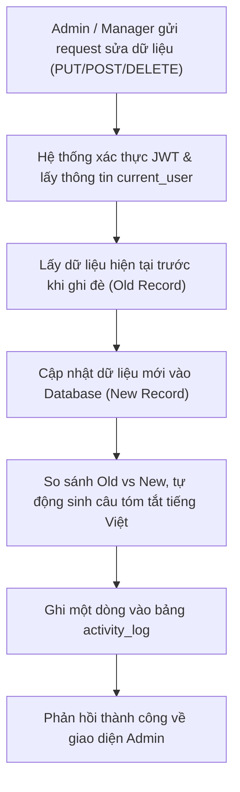

# TÀI LIỆU THIẾT KẾ: HỆ THỐNG NHẬT KÝ CHỈNH SỬA DỮ LIỆU (AUDIT / ACTIVITY LOG)

> **Mục tiêu:** Lưu lại lịch sử khi người dùng thao tác thêm/sửa/xóa/đổi vị trí dữ liệu trên trang Admin dưới dạng ngôn ngữ tự nhiên (tiếng Việt), giúp người quản lý dễ dàng đọc hiểu mà không cần kiến thức lập trình.

---

## 1. Cấu trúc Bảng Database (`activity_log`)

```sql
CREATE TABLE IF NOT EXISTS activity_log (
    id INT AUTO_INCREMENT PRIMARY KEY,
    user_id INT NOT NULL,
    user_name VARCHAR(100) NOT NULL,
    user_role VARCHAR(50) NOT NULL,
    action VARCHAR(50) NOT NULL,          -- CREATE, UPDATE, DELETE, REORDER, TOGGLE_STATUS
    module VARCHAR(100) NOT NULL,         -- Menu điều hướng, Sự kiện, Bài viết, Đào tạo, Dự án, Biểu mẫu liên hệ...
    target_id INT NULL,                   -- ID của bản ghi bị tác động
    summary VARCHAR(500) NOT NULL,        -- Câu tóm tắt bằng tiếng Việt tự nhiên cho quản lý
    changes JSON NULL,                    -- Chi tiết các trường thay đổi (Dữ liệu cũ -> Mới)
    created_at DATETIME DEFAULT CURRENT_TIMESTAMP,
    FOREIGN KEY (user_id) REFERENCES user(id) ON DELETE CASCADE
);
```

---

## 2. Các trường thông tin & Ví dụ thực tế

| Trường | Ví dụ giá trị | Ý nghĩa hiển thị cho Quản lý |
| :--- | :--- | :--- |
| `user_name` | `hoang_manager` | Tên người thực hiện thay đổi |
| `user_role` | `manager` | Vai trò của tài khoản |
| `module` | `Menu trang` | Khu vực bị chỉnh sửa |
| `action` | `UPDATE` | Loại hành động |
| `summary` | *"Đã đổi tên trang từ 'Sự kiện 2025' thành 'Sự kiện 2026'"* | Dòng tóm tắt hiển thị trên màn hình dòng thời gian (Timeline) |
| `changes` | `{"title": {"old": "Sự kiện 2025", "new": "Sự kiện 2026"}}` | Dữ liệu đối chiếu chi tiết Trước / Sau khi sửa |
| `created_at`| `2026-10-07 14:30:00` | Ngày giờ thao tác |

---

## 3. Quy trình ghi Log trong Backend (Flow chi tiết)



### Mã mẫu Helper Backend (`services/audit_service.py`):
```python
from flask import g
from models.ActivityLogModel import ActivityLog
from extensions import db

def log_activity(action, module, summary, target_id=None, changes=None):
    current_user = getattr(g, "current_user", None)
    if not current_user:
        return
    
    log = ActivityLog(
        user_id=current_user.id,
        user_name=current_user.full_name or current_user.username,
        user_role=current_user.role,
        action=action,
        module=module,
        target_id=target_id,
        summary=summary,
        changes=changes
    )
    db.session.add(log)
    db.session.commit()
```

---

## 4. Giao diện hiển thị đề xuất cho Admin

1. **Widget trên Dashboard**: Hiển thị 5 thao tác mới nhất của nhân viên trong ngày.
2. **Trang Nhật ký hoạt động toàn hệ thống**:
   - Bộ lọc theo: Nhân viên thực hiện, Ngày tháng, Khu vực (Menu, Sự kiện...).
   - Bảng hiển thị: Thời gian, Nhân viên, Khu vực, Tóm tắt thay đổi.
   - Nút bấm **"Xem chi tiết"** mở popup so sánh cột **Cũ (Đỏ)** và **Mới (Xanh)**.

